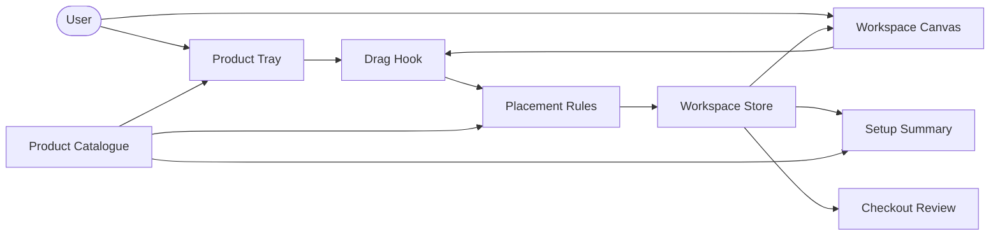

# Worbee — Workspace Builder Front-End Architecture

## 1. Purpose

Worbee is a Next.js and TypeScript front-end for designing a rental-ready workspace. Users browse furniture sprites, drag them onto an isometric workspace, adjust their arrangement, and review a live rental summary.

This document defines front-end component ownership, dependency direction, state, visual assets, and interaction rules. Product requirements live in [`prd.md`](prd.md), visual guidance lives in [`design.md`](design.md), and delivery work is tracked in [`task.md`](task.md).

## 2. Front-end goals

- Make the sprite workspace feel immediate and tactile on desktop and mobile.
- Keep product selection, drag-and-drop, visual placement, and pricing in sync.
- Keep layout, interaction rules, and catalogue data easy to change independently.
- Use a responsive, accessible UI built with Next.js and Tailwind CSS.
- Preserve an unfinished workspace locally so a refresh does not discard the user’s design.
- Keep the first release lightweight: no 3D engine, canvas-rendering engine, or large drag-and-drop framework.

## 3. Technology choices

| Concern | Choice | Why |
| --- | --- | --- |
| Application | Next.js App Router + TypeScript | Route-based pages and a clear home for interactive client components |
| Styling | Tailwind CSS | Fast, consistent responsive styling and design tokens |
| Workspace scene | Layered HTML elements and transparent PNG/WebP sprites | Crisp isometric visuals without a 3D runtime |
| Drag interaction | Native Pointer Events | Precise pointer/touch control inside a scaled scene |
| Local UI state | Zustand | Small shared store for the active design and drag state |
| Forms | React Hook Form + Zod | Clear form state and user-friendly validation |
| Persistence | Browser `localStorage` | Restores the workspace draft between visits |
| Deployment | Vercel | Native Next.js deployment path |

## 4. Application structure

```text
app/
├── layout.tsx                      # Fonts, metadata, global providers
├── page.tsx                        # Builder page
├── checkout/
│   └── page.tsx                    # Setup review and enquiry form
└── globals.css                     # Tailwind layers and global styles

components/
├── builder/
│   ├── WorkspaceBuilder.tsx        # Builder composition and layout
│   ├── WorkspaceCanvas.tsx         # Isometric drop area and scene layers
│   ├── WorkspaceItem.tsx           # One selected, draggable sprite
│   ├── ProductTray.tsx             # Category tabs and available products
│   ├── ProductCard.tsx             # Product card and drag source
│   ├── SceneHotspot.tsx            # “Add monitor” / “Place plant” action
│   ├── DragPreview.tsx             # Pointer-following placement preview
│   ├── PlacementToolbar.tsx        # Remove, reset, and selection controls
│   └── SetupSummary.tsx            # Live item count and monthly estimate
├── checkout/
│   ├── SetupReview.tsx             # Itemized selected setup
│   └── EnquiryForm.tsx             # Contact and delivery details
└── ui/
    ├── Button.tsx
    ├── Dialog.tsx
    ├── Tabs.tsx
    └── Toast.tsx

hooks/
├── useWorkspaceDrag.ts             # Pointer-to-canvas drag lifecycle
├── useCanvasScale.ts               # Responsive canvas sizing
└── useDraftPersistence.ts          # Draft restore and local save

lib/
├── catalog.ts                      # Product list, price, and sprite metadata
├── placement.ts                    # Bounds, snapping, surfaces, collisions
├── pricing.ts                      # Derived monthly estimate
├── workspace-store.ts              # Zustand store
└── form-schema.ts                  # Browser-side form validation schema

types/
├── catalog.ts
└── workspace.ts

public/
└── assets/
    ├── scene/                      # Background and floor artwork
    └── sprites/                    # Transparent furniture and accessory assets
```

## 5. Dependency direction

```text
app pages
  → feature components
    → feature hooks
      → workspace store + pure workspace libraries
        → static catalogue data and shared types

shared UI components
  → Tailwind styles and generic utilities only
```

### Boundaries to preserve

- Page components compose feature components; they do not contain drag geometry or pricing logic.
- Builder components read state and dispatch user actions; `lib/placement.ts` owns placement decisions.
- The product catalogue owns product names, prices, sprite paths, and placement capabilities.
- The workspace store owns only current user choices and interaction state; it does not duplicate catalogue data.
- Shared UI components remain generic and do not import builder-specific state or product data.
- Derived totals, quantities, and selected-product lists are computed from the active items plus catalogue data—not stored as separate mutable values.

## 6. Builder component model



### Component responsibilities

| Component | Responsibility |
| --- | --- |
| `WorkspaceBuilder` | Arranges the tray, canvas, toolbar, and summary for the page |
| `ProductTray` | Shows category tabs: desks, chairs, accessories, and future zones |
| `ProductCard` | Communicates product details and starts drag or tap-to-place interaction |
| `WorkspaceCanvas` | Scales the scene, renders layers, exposes valid drop targets, and keeps selection visible |
| `WorkspaceItem` | Renders a placed sprite, selection outline, and direct manipulation controls |
| `DragPreview` | Shows the proposed position before the user releases an item |
| `SceneHotspot` | Offers contextual shortcuts such as “Add monitor” when the appropriate surface is empty |
| `SetupSummary` | Displays selected items, quantities, monthly estimate, and checkout action |
| `SetupReview` | Presents the final itemized setup before the enquiry form |

## 7. Isometric sprite scene

### Canvas layout

`WorkspaceCanvas` is a responsive container with a stable internal coordinate system—for example, `1200 × 760`. CSS scales this coordinate system to fit the available space; placement coordinates are always stored in the stable coordinate system, not viewport pixels.

The visual stack is:

1. Room background and floor illustration
2. Optional ground shadows
3. Floor furniture: desks, chairs, shelves, plants
4. Desk-surface items: monitors, lamps, keyboards, desk plants
5. Selected-item outline and drag preview
6. Contextual hotspots and placement feedback

Every item is an absolutely positioned image. An item’s displayed depth is calculated from its lower visual edge so furniture nearer the viewer appears in front of furniture behind it.

### Sprite contract

Every sprite must share the same front-left isometric perspective, lighting direction, scale family, and shadow treatment. Each catalogue entry supplies the layout information that a PNG alone cannot provide.

```ts
type Product = {
  id: string
  category: 'desk' | 'chair' | 'accessory' | 'zone'
  name: string
  monthlyPrice: number
  sprite: {
    src: string
    width: number
    height: number
    anchor: { x: number; y: number }
  }
  placement: {
    allowedSurfaces: Array<'floor' | 'desk'>
    footprint: { width: number; height: number }
    maxQuantity: number
  }
}

type PlacedItem = {
  instanceId: string
  productId: string
  x: number
  y: number
  surface: 'floor' | `desk:${string}`
}
```

`anchor` marks the floor-contact point inside an image. It prevents transparent image padding from making a desk, chair, or plant look incorrectly placed.

## 8. Drag-and-drop design

### Why Pointer Events

Native Pointer Events are the interaction foundation. They handle mouse, trackpad, touch, and pen input consistently, while allowing the builder to translate pointer movement into its own isometric canvas coordinates.

### Interaction sequence

1. The user presses a product card or placed item.
2. `useWorkspaceDrag` records the active product and pointer offset.
3. Pointer movement is converted from screen pixels to canvas coordinates.
4. `placement.ts` returns the nearest proposed valid placement.
5. `DragPreview` follows the pointer; valid positions receive a subtle affirmative highlight, while invalid positions show a clear rejection state.
6. On release, the store adds or moves the item only when placement is valid.
7. The workspace, summary, and checkout review update from the same store state.

### Placement rules

- Desks, chairs, storage, and floor plants snap to the floor grid and stay within the scene bounds.
- Monitors, lamps, keyboards, and desk plants can only be placed on compatible desk surfaces.
- Furniture footprints cannot overlap.
- Selecting a second primary desk replaces the current desk through an explicit confirmation or brief undo action.
- Product quantity limits stop extra copies from being placed.
- Removing an item is available from the selection toolbar and by keyboard.

### Mobile fallback

Drag remains available on touch screens, but every product also supports a tap-to-place path:

1. Tap a product card to enter placement mode.
2. The canvas highlights valid positions or compatible desks.
3. Tap a highlighted target to place the product.
4. Tap again or use Cancel to leave placement mode.

## 9. Workspace state

The Zustand store is the single source of truth for the in-progress workspace. It contains only user-driven configuration and interaction state.

```ts
type BuilderState = {
  items: PlacedItem[]
  selectedItemId?: string
  activeCategory: 'desk' | 'chair' | 'accessory' | 'zone'
  placementMode?: { productId: string }
  drag?: { productId: string; source: 'tray' | 'canvas' }
  addItem: (item: PlacedItem) => void
  moveItem: (instanceId: string, x: number, y: number) => void
  removeItem: (instanceId: string) => void
  selectItem: (instanceId?: string) => void
  reset: () => void
}
```

`useDraftPersistence` saves the configured items to browser storage after a settled change and restores them when the builder opens. It should store versioned, minimal data—product IDs and placement coordinates—rather than a duplicated copy of the product catalogue.

## 10. Summary and checkout experience

`SetupSummary` is visible throughout the builder and reads derived values from the store:

- selected item count
- quantities by product
- estimated monthly rental total
- concise delivery/installation note
- route to the final setup review

The checkout page uses the same active draft. `SetupReview` presents the itemized workspace before `EnquiryForm` collects the user’s details. Form validation occurs in the browser with clear inline errors, sensible defaults, and an accessible success state once the user completes the flow.

## 11. Accessibility and performance

### Accessibility

- Product cards, category tabs, canvas items, and remove actions are keyboard reachable.
- Keyboard users can select an item, choose a valid surface or zone, and place it without dragging.
- Changes to selection, placement validity, total price, and errors are announced through concise status text.
- Dragging is never the only way to configure the workspace.
- Sprite images use descriptive alternative text where the image contributes meaning; decorative scene layers are hidden from assistive technology.

### Performance

- Use optimized transparent sprites and explicit image dimensions to avoid layout shifts.
- Load the starter scene immediately; defer unused product categories until the user opens them.
- Apply transforms during dragging rather than triggering expensive layout work.
- Keep collision calculation in pure functions and update only the dragging preview while the pointer moves.
- Avoid rendering a canvas or WebGL scene; the DOM sprite model is sufficient for the first release.

## 12. Front-end delivery phases

### Phase 1 — Interactive builder

- Static product catalogue and core sprite set.
- Isometric scene with two desk options, two chair options, monitor, lamp, and plant.
- Mouse and touch drag/drop, snapping, valid/invalid feedback, reset, and live summary.

### Phase 2 — Polished configuration

- Contextual add hotspots, selection toolbar, tap-to-place mobile flow, and draft persistence.
- Keyboard placement alternative and improved responsive layouts.

### Phase 3 — Checkout experience and optional zones

- Itemized setup review and validated enquiry form UI.
- Coffee station, relax zone, outdoor gear, and storage collections with their own sprite sets and placement surfaces.

## 13. Front-end definition of done

- A user can choose, drag, move, and remove desk, chair, and accessory sprites.
- The builder prevents invalid placements and explains why a location is unavailable.
- The scene, product tray, summary, and checkout review represent one shared workspace draft.
- The core configuration flow works with mouse, touch, and keyboard controls.
- The interface is responsive, visually consistent, and ready for deployment on Vercel.
